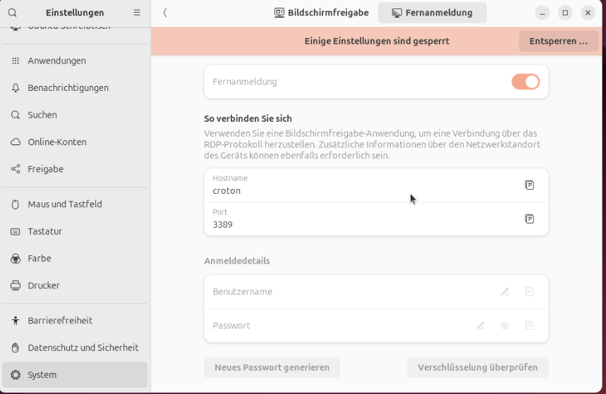

# RDP

Eine RDP (Remote Desktop Protocol) Verbindung ermöglicht es, einen Computer aus der Ferne zu steuern und zu bedienen, so als würde man direkt vor dem Bildschirm sitzen. Sie dient zum Zugriff auf Programme, Dateien und Netzwerkressourcen eines entfernten Computers. 

## RDP Server

Im Bereich **Sytem Einstellungen / System / Bildschirmfreigaben / Fernanmeldung** den zu erreichende PC konfigurieren.

## Client
Als Client Software kann **Remmina** verwendet werden. Hier das RDP Protokoll wählen und die IP des Host eingeben.
