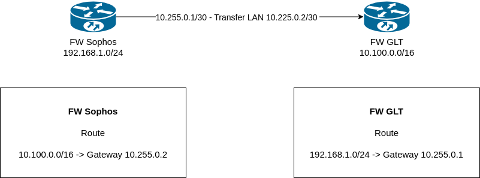

# Netzwerk Routing

Routing von zwei unterschiedlichen Lans

## Aufbau der Verbindung
Beide FW sind per LAN (Transferlan /30) miteinander verbunden.

Erfolgt nun im LAN der FW Sophos (192.168.1.0/24) eine Anfrage an das LAN der FW GLT (10.100.0.0/16) erfolgt ein Routing
über das "Transfer Lan" der beiden FW jeweils zum GW der anderen Firewall.

