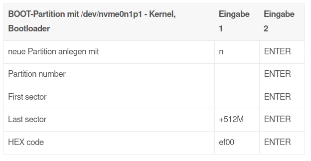
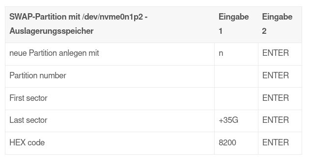
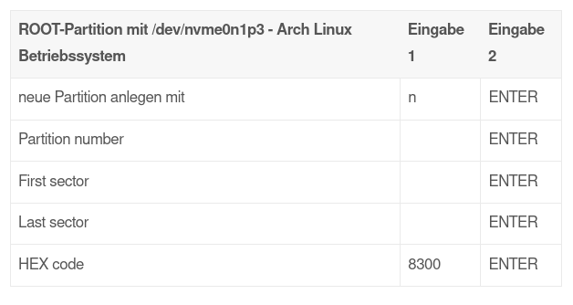

# arch Linux installieren

## Installation
Das neueste ISO-Abbild kann von [www.archlinux.de/download/](https://www.archlinux.de/download/) heruntergeladen werden.

+ [Anleitung für Anfänger](https://wiki.archlinux.de/title/Anleitung_f%C3%BCr_Einsteiger)
+ [Vorbereitung der Installation](https://wiki.archlinux.de/title/1._Vorbereitung)
+ [Installation](https://kofler.info/arch-linux-installieren/)
+ [Installation weitere Anleitung](https://ro-kom.de/video-archinstall/)
+ [Installation](https://akolles.de/arch-linux/arch-linux-installation)

Das ISO-Abbild beinhaltet nur die nötigen Programme, um ein minimales GNU/Linux Grundsystem zu installieren. Beachte, dass ein minimales Grundsystem keine grafische Oberfläche enthält. Der Rest des Arch Linux Systems - einschließlich grafischer Oberfläche - wird von der Kommandozeile aus eingerichtet. Dieser Prozess wird detailliert weiter unten besprochen. 

## ISO-Abbild prüfen

Beim Download mittels Torrent oder Magnet Link wird die ISO-Datei automatisch nach dem Download auf Übereinstimmung mit dem Original überprüft. Wird das ISO-Abbild per HTTPS heruntergeladen, sollte eine Prüfung mit der SHA1-Summe stattfinden. Soll eine CD oder DVD erstellt werden, ist es besser die Prüfung auf Übereinstimmung erst nach dem Brennvorgang zu tätigen.
```
sha1sum archlinux-*-x86_64.iso
```
( * ist mit dem Datum der Arch.iso Datei zu ersetzen.) Die so ermittelte Zeichenkette sollte mit den Angaben auf der Webseite übereinstimmen. 

## ISO-Abbild auf USB-Stick übertragen

Der USB-Stick darf nicht gemountet sein. Zunächst sollte mit folgendem Befehl die Partitionsbezeichnung des USB-Stick ermittelt werden:
```
# fdisk -l
```
Danach kann die ISO-Datei auf den Stick übertragen werden.
```
# dd bs=4M if=/pfad/archlinux-*-x86_64.iso of=/dev/sdx status=progress oflag=sync
```
Dabei ist sdx der erkannte USB-Stick. (x ist durch den entsprechenden Buchstaben zu ersetzen.) Beachte: Alle Daten auf dem USB-Stick werden gelöscht!

## Verbindung per SSH
Vergeben eines Passworts
```
passwd
```

## Ändern der Tastaturbelegung

Zu diesem Zeitpunkt ist noch das US-englische Tastaturlayout eingestellt. Zum deutschsprachigen Tastaturlayout wird wie folgt gewechselt:

    loadkeys de-latin1

## Partitionierung der Festplatte

Meine für diese Anleitung verwendete 2 TByte große M.2 Samsung SSD 970 EVO Plus wird gelöscht und soll anschließend in eine **512 MByte Boot**- sowie in eine **35 GByte Swap-Partition** aufgeteilt werden, die von der Größe her in etwa der des Arbeitsspeichers entspricht. Die dritte Partition wird für das Betriebssystem bereitgestellt, auf der Archlinux samt Homeverzeichnis installiert werden soll. Die einzelnen Partitionen sind dabei in nvme0n1p1 .. p2 .. p3 unterteilt.

Mit **lsblk** verschafft man sich einen Überblick über vorhandene Partitionen und angeschlossene Festplatten. Hier muß man sehr darauf achten, die richtige Festplatte zu "erwischen", ansonsten droht Datenverlust! Nicht benötigte, externe Festplatten sollte man sowieso vorher abklemmen.

Zum Partionieren eines UEFI Systems benutze ich nun das mitgelieferte Partitionierungswerkzeug **gdisk**. Der Aufruf erfolgt in meinem Beispiel mit

```
gdisk /dev/nvme0n1
```
Mit Eingabe von **"o"** lösche ich alle evtl. vorhandenen Partitionen und mit Eingabe von **"n"** wird eine neue Partition angelegt. Die möglichen einzelnen Arbeitsschritte sehen in tabellarischer Form folgendermaßen aus:

### BOOT-Partition







+ [Quelle](https://akolles.de/arch-linux/arch-linux-installation)

## Dateisysteme anlegen

Mit **mkfs** (make file system) werden die Dateisysteme angelegt und formatiert.

**Boot-Partition**

        mkfs.fat -F32 -n BOOT /dev/sdX

**Swap-Partition**

        mkswap -L SWAP /dev/sdX

**Root-Partition**

        mkfs.ext4 -L ROOT /dev/sdX

## Dateisysteme einhängen

Zuerst wird die System-Partition (ROOT) am Einhängepunkt /mnt eingehängt. Das Device (hier: Root-Partition) /dev/nvme0n1p3 wird eingehängt und unter /mnt per Label -L verfügbar gemacht:

        mount -L ROOT /mnt

Die Boot-Partition wird in einem /mnt Unterverzeichnis von ROOT verfügbar gemacht. Zuvor muß jedoch das boot-Verzeichnis angelegt werden:

        mkdir /mnt/boot

        mount -L BOOT /mnt/boot/

Das Aktivieren bzw. Einschalten der Swap-Partition geht mit dem Aufruf:

        swapon -L SWAP

Die Festplatte ist nun für die Arch Linux Installation vorbereitet. Möchte man noch eine weitere interne Festplattenpartition (z.B. sda1) dauerhaft in die fstab einhängen, so muß zuerst das gewünschte Verzeichnis erstellt und dann an passender Stelle eingehängt werden. Zuvor verschafft man sich einen Überblick per lsblk.

        mkdir /mnt/interne_Festplatte

        mount /dev/sda1 /mnt/interne_Festplatte

## Installation des Basissystems | fstab erzeugen | arch-chroot

Auf dem Live-System aktualisiert Reflector nach der Verbindung mit dem Internet die Spiegelliste für die zu installierenden Pakete in der Datei "/etc/pacman.d/mirrorlist". Diese Datei wird später per Pacstrap auf das neue System kopiert. Es lohnt sich also, diese Mirrorliste gleich zu Beginn nach eigenen Bedürfnissen anzupassen:

          sudo nano /etc/pacman.d/mirrorlist

wobei **STRG + K** unerwünschte Zeilen löscht bzw. ausgeschnitten und ggf. an passender Stelle wieder mit **STRG + U** (Zeile für Zeile) eingefügt werden können. Abschließend speichern mit **STRG + O** und beenden mit **STRG + X**.

Als nächstes wird das Arch Linux Basissystem durch Aufruf von **pacstrap** installiert:

        pacstrap /mnt base base-devel linux linux-firmware dhcpcd nano

Die Gruppe **"base"** lädt Pakete aus dem Repository für ein minimales System, **"base-devel"** lädt zusätzlich Extra-Tools, die es ermöglichen, weitere Software aus dem AUR zu installieren.

Die Pakete **intel-ucode** bzw. **amd-ucode** sorgen für Fehlerbereinigungen und Verbesserungen für die CPU, je nachdem, ob ein Intel- oder AMD-Prozessor verbaut ist:

      pacstrap /mnt intel-ucode

oder

      pacstrap /mnt amd-ucode

Die Konfigurationsdatei fstab (file system table) liegt im Verzeichnis /etc/fstab und enthält eine Liste aller dauerhaft zu mountender Dateisysteme. Alle angelegten Partitionen sind bereits mit einem Label L (siehe: f. Dateisysteme anlegen) versehen:

      genfstab -Lp /mnt > /mnt/etc/fstab

Die Datei fstab wird mit allen eingebundenen, bereits gemounteten (!) Laufwerken erzeugt. Das Programm genfstab nimmt also nur die Geräte in die Datei fstab auf, die bereits gemountet sind. Auf diese Weise können auch nachträglich Festplatten oder andere Laufwerke an das System angebunden und anschließend in die Datei fstab aufgenommen werden.

Mit dem cat Aufruf läßt sich fstab nochmals anzeigen:

      cat /mnt/etc/fstab

Mit diesem Aufruf wechselt man vom Live ISO in das neue System von /mnt

      arch-chroot /mnt

## Benutzer einrichten

Der Rechnername wird festgelegt (hier: kitty) mit

    echo kitty > /etc/hostname

Setzen des Root-Passwortes mit

    passwd

Einen Benutzer mit useradd hinzufügen. Der Benutzername darf nur Kleinbuchstaben und Sonderzeichen enthalten. Der Benutzername ist hier wieder mit "kitty" gewählt.

    useradd -m -g users -s /bin/bash kitty

Passwortvergabe für den Benutzer "kitty" mit zweifacher Passworteingabe:

    passwd kitty

Benutzer kitty zur Gruppe wheel hinzufügen:

    gpasswd -a kitty wheel

Damit der Benutzer Rootrechte erhält, muß eine Konfiguration verändert werden:

    EDITOR=nano visudo

Bei folgenden Zeilen müssen die Kommentarzeichen # und das Leerzeichen entfernt werden:

    # %wheel ALL=(ALL:ALL) ALL

Nach dem Abspeichern haben damit alle User der Gruppe wheel Administratorrechte, wenn sie sudo verwenden.    

## Sprach-Einstellungen

Die Systemsprache wird auf Deutsch eingestellt.

    echo LANG=de_DE.UTF-8 > /etc/locale.conf

Die Konfigurationsdatei locale.gen mit dem nano Editor öffnen:

    nano /etc/locale.gen

Das Kommentarzeichen "#" am Anfang folgender Zeilen entfernen und dann abspeichern mit STRG+O und ENTER und beenden mit STRG+X:

```
#de_DE.UTF-8 UTF-8
#de_DE ISO-8859-1
#de_DE@euro ISO-8859-15
#en_US.UTF-8 UTF-8
```

Abschließend generieren mit:

    locale-gen

Die Tastaturbelegung und Schriftart in vconsole.conf festlegen:

```  
  echo KEYMAP=de-latin1 > /etc/vconsole.conf

  echo FONT=lat9w-16 >> /etc/vconsole.conf
```

Die Zeitzone festlegen:

    ln -sf /usr/share/zoneinfo/Europe/Berlin /etc/localtime

## Der Paketmanager

Über die **"pacman.conf"** Datei läßt sich das Aussehen und Verhalten des Paketmanagers Pacman ändern. Mit Nano wird diese Datei geöffnet:

    sudo nano /etc/pacman.conf

In den **"Misc options"** werden durch das Entfernen des #-Zeichen bei **"Color"** bestimmte Zeichen farbig dargestellt. Durch Einfügen in einer leeren Zeile ILoveCandy wird dem Fortschrittsbalken ein richtiger Pacman hinzugefügt!

Falls man für das 64bit Betriebssystem 32bit Bibliotheken benötigt, muss bei "multilib" das Multilib-Repository aktiviert werden:

```
[multilib-testing]
Include = /etc/pacman.d/mirrorlist
[multilib]
Include = /etc/pacman.d/mirrorlist
```

Mit CRTL+O und ENTER abspeichern und mit CRTL+X beenden.

Anschließend muß die Pacman Repository Datenbanken neu geladen werden:

    pacman -Sy

Es wird ein Abbild des Systems erstellt, welches in den Arbeitsspeicher geladen wird.

    mkinitcpio -p linux

## Nützliche Programme, Tools und Dienste

+ [pacman Befehle](pacman/Readme.md)

```
pacman -S --noconfirm acpid avahi cups cups-pdf ghostscript mtools udisks2 git
```
```
pacman -S --noconfirm ntfs-3g unrar unzip neofetch reflector
```
```
pacman -S --noconfirm appstream-glib libunrar libdvdcss simple-scan
```
```
pacman -S --noconfirm ttf-dejavu ttf-liberation noto-fonts ttf-opensans
```
```
pacman -S --noconfirm alsa-tools alsa-utils pulseaudio-alsa pavucontrol
```
```
pacman -S --noconfirm bash-completion networkmanager network-manager-applet gvfs
```
**Acpid** steht für die Energieverwaltung, **avahi** für die Netzwerkerkennung und **cups** für den Drucker. Das **UDisks**- und das **gvfs-Pake**t enthalten Tools und Bibliotheken für den Zugriff auf Festplatten und Speichergeräten und dessen Bearbeitung. Das **ntfs-3g-Paket** ermöglicht den Zugriff auf ntfs-formatierte Festplatten unter Windows-Betriebssystemen.

## Installation von X, Grafiktreiber und der Xfce-Desktop

X ermöglicht die Benutzung einer graphischen Oberfläche unter einem Linux-System. Die Basispakete von Xorg werden installiert mit

    pacman -S xorg-server xorg-xinit

Nun wird der Treiber für die Grafikkarte hinzugefügt. Mit

    lspci | grep VGA

zeigt die vorhandene Grafikkarte. In meinem Rechner steckt eine NVidia GTX 1070. PC-Spieler mit einer NVidia-Karte wählen vorzugsweise den proprietären NVidia Grafiktreiber:

NVidia & Vulkan Treiber
```
pacman -S eglexternalplatform egl-wayland
```
```
pacman -S nvidia nvidia-settings lib32-nvidia-utils
```
```
pacman -S vulkan-icd-loader lib32-vulkan-icd-loader
```

Wem der Open Source Treiber reicht, gibt für seine Grafikkarte den passenden Befehl ein:
```
Intel 	pacman -S xf86-video-intel
```
```
AMD 	pacman -S xf86-video-amdgpu
```
```
Nvidia 	pacman -S xf86-video-nouveau
```

Ist man sich jedoch weiterhin unsicher, welches Treiber-Paket zu seiner Grafikkarte paßt, so lassen sich auch die gesamten Videotreiber installieren:

    pacman -S xorg-drivers

Xfce gehört zu den stabilsten und sparsamsten Bedienungsoberflächen unter Linux. Die Basis Xfce-Installation mit einigen Extras:
```
pacman -S xfce4 xfce4-goodies arc-gtk-theme
```
```
pacman -S lightdm lightdm-gtk-greeter lightdm-gtk-greeter-settings
```

Über **/etc/lightdm/lightdm-gtk-greeter.conf** läßt sich später das Hintergrundbild auf dem Begrüßungsbildschirm anzupassen. Siehe auch 

+ [Xfce4-Desktop konfigurieren](https://akolles.de/arch-linux/tips#login)
+ [ArchLinux Desktop anpassen](Desktop/Readme.md)

## Benötigte Dienste aktivieren

Um diese Dienste automatisch beim Booten zu starten, werden sie mit folgendem Aufruf aktiviert:

```
systemctl enable acpid avahi-daemon cups.service
```
```
systemctl enable lightdm.service NetworkManager
```
```
systemctl enable fstrim.timer systemd-timesyncd.service
```
```
systemctl enable reflector.timer
```
Der **acpid Dienst** sorgt für die Energieverwaltung, **avahi** für die Netzwerkerkennung und **cups** ist ein Drucksystem für Linux, worüber sich zahlreiche Drucker nutzen lassen. Der Dienst **lightdm.service** bzw. **lightdm** richtet den Login-Manager für den Xfce-Deskop ein. Bitte auf Großschreibung NetworkManager achten. Beim ersten Start des Systems startet der Display-Manager und nach dem Login läuft der Network-Manager, der automatisch eine IP-Adresse mit einer Internetverbindung erstellt.

Wird das System, wie in unserem Falle, auf einer SSD betrieben, die TRIM unterstützt, sollte der **fstrim.timer** aktiviert werden. Für die automatische Korrektur der Zeit mit der Atomuhr über das Internet sorgt timesyncd. Die Serverliste wird mit reflector.timer für kommende Updates aktuell gehalten.

## EFISTUB Uefi

Mit **EFISTUB** kann der Linux Kernel direkt vom UEFI-Motherboard gebootet werden, wobei **Secure Boot de-aktiviert werden sollte** !

    pacman -S efibootmgr dosfstools gptfdisk

    efibootmgr -c -d /dev/nvme0n1 -p 1 -l \vmlinuz-linux -L "Arch Linux" -u "initrd=/initramfs-linux.img root=/dev/nvme0n1p3 rw"

Die Boot Partition wird über die **fstab** gemountet, wobei der Eintrag in der fstab dann so oder ähnlich aussehen müßte:

    /dev/nvme0n1 /boot /vfat defaults,noatime 0 0

+ [Weiter Informationen zu EFISTUB](https://wiki.archlinux.de/title/EFISTUB)

Es können natürlich auch andere Bootloader verwendet werden. Ein Auswahl mit Anleitung gibt es hier auf dieser Seite:

+ [Weitere Bootloader](https://akolles.de/boot_and_backups/bootloader)

## Neustart

Nachdem alles Benötigte installiert und konfiguriert ist, kann das installierte Arch Linux bzw. die Chroot Umgebung verlassen werden mit dem Aufruf:

  ```
  exit
  umount -R /mnt
  ```

Der Rechner-Neustart erfolgt mit:

    reboot
